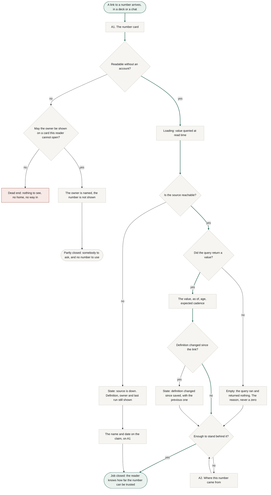
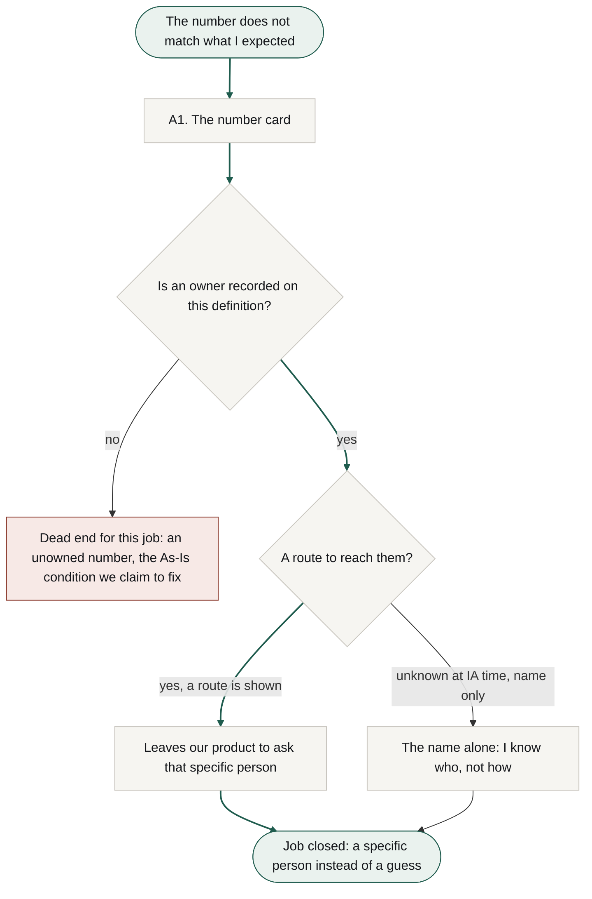
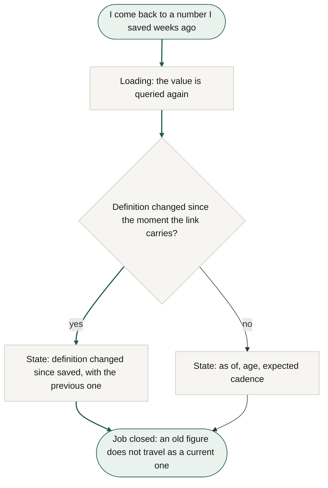
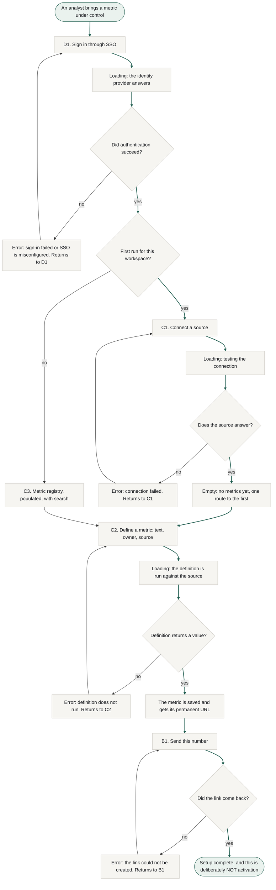

# User flows

Stage 03a, step 4. Routes traced onto the To-Be phases in `research/docs/cjm-to-be.md`, with the As-Is barriers in `cjm-as-is.md` supplying the decision points and the dead ends. Nothing here is invented from the jobs alone.

**Colour is semantic, not decorative.** Green marks the two ends of the happy path, start and job closed, and the path itself is drawn with green arrows. Red marks a **true dead end**, a node with no route to the goal. Grey is everything between, including an error that recovers back into the flow. Tokens are the ones on `research.html`, so the diagrams sit on a light ground rather than punching a dark hole in the page.

Four flows: the main job, two related jobs of the primary persona, and one of the secondary. Every screen node exists in the concept sitemap; nodes that are states or steps rather than screens are named as such underneath each diagram.

---

## Flow 1. Main job: knowing how far the number can be trusted

Traces T1, T2 and T3 in `cjm-to-be.md`. The decision points come from the phase B and phase C barriers.

**Activation node: `A1`.** Activation is the first time a metric card is opened by somebody other than the author of its definition (`aarrr.md`). It is the **first node after the start and sits at zero taps from arrival**, which is what the research asked for: the product does not defer its first value behind anything.

**Decisions.** Whether the card is readable without an account. Whether the source answers. Whether the definition changed after the link was made. Whether what is shown is enough to stand behind.

**States.** Loading while the value is queried, because we store no rows and the number is pulled at read time. "Source is down", which still shows the definition, the owner and the last successful run. **"Empty", added at the critique: the query ran and returned nothing.** That is a different event from a source being down and it must never be rendered as a zero, which would be a bare figure of the worst kind. "Definition changed after this was saved", carrying the previous definition as a line.

**The dead end was narrowed at the first critique and corrected again at the second.** A reader who lands on a card they may not see still has nowhere to go, but naming a price is not the same as paying the smallest one. The route now asks a question first: **may the owner be shown on a card this reader cannot open?** If yes, the reader gets a name to ask. **That end is deliberately not the green one:** knowing who owns a card you cannot open is not knowing how far a number can be trusted, and the first repair routed it into the closed-job node, which overclaimed. It now ends at a partial close, somebody to ask and no number to use. If no, the dead end stands, red, and it is the direct price of flattening the reader's navigation to nothing. The question itself is open research, `research.md` OQ7, what a data lead considers safe to show.

**A consequence of metadata-only, visible here for the first time.** When the source is down there is no value at all, not even a stale one, because we keep no copy. The route does not die there: the definition, the owner and the age of the last successful run are enough to close the main job in its honest form, since the job is to know how far a number can be trusted, not to hold one. **This is the node where the main job and R1 join.**

---

## Flow 2. R1: finding out who is answerable

Traces T4. The `[?]` on the owner's contact route from the entity inventory becomes a decision here rather than staying an open note.

**Decisions.** Two after the critique. Whether an owner is recorded on this definition at all, and whether we may show a route to reach them. The second answer is unknown: `personas.md` records that the reader has no account and that what a data lead considers safe to show is an open question.

**The unowned number is a real dead end and it is drawn red.** Note that flow 1 asks whether the owner may be *shown* and does not ask whether one exists; a second diamond there would double the depth of an already long diagram, and in practice a definition cannot be saved without an owner. The case the two flows really disagree about is an owner who has left the company, which nothing prevents. A definition with no owner leaves this job unclosed and puts the reader back in the As-Is condition we claim to fix. It is prevented structurally at C2, which cannot save a definition without an owner, and it stays in the diagram because **an owner who leaves the company is prevented by nothing**: we do not track employment, and MVP has no import path that could bring in ownerless definitions.

**Why both branches close the job.** R1 is worded as finding out **who** is answerable, so knowing the name closes it and the asking happens outside our product. The branch without a route is not red, and it is not free either: it returns the reader to the As-Is behaviour of working out how to reach somebody, which is exactly the friction we claim to remove. It is the weakest branch in this IA.

**No screen exists for a person.** The owner is visible on A1 and set on C2, and never gets a page of their own.

---

## Flow 3. R4: an old figure does not travel as a current one

Traces T5. **This flow settles the fork left open in the entity inventory.**

**What this flow decided, and it is a real IA result rather than a drawing.** Entity E6, the reading, was left `[?]` at step 1: either the reading is a stored object or the moment is encoded in the link. There is no third option and no neutral one. **If the link does not carry the moment it was read, R4 cannot be served at all**: the state degrades to "the definition changed at some point", which asks the reader to remember when they took the number, which is the very thing they came to us to avoid.

**Resolution: the moment is carried in the link, not stored as an object.** That keeps the permanent URL per metric and adds no record about a reader who has no account.

**Corrected at the critique: the rejected alternative is no longer drawn as a route.** The first version of this diagram kept a red node for a link that carries no moment. That asserted a dead end the product does not have, since the decision had already been taken, and a dead end drawn where none exists is as misleading as one hidden. The rejected option lives in this paragraph, which is where a decision belongs.

**Decisions.** One: whether the definition changed since the moment the link carries.

**States.** Loading, "definition changed after this was saved" with the previous definition, and the ordinary "as of".

---

## Flow 4. R5: the definition stops living in somebody's head

The secondary persona. Included because R5 and the source connection are preconditions of every flow above, and because the errors here are the only ones in the product that a person can actually fix.

**There is no red node in this flow, and that is not carelessness.** Every error recovers: failed sign-in returns to D1, a failed connection returns to C1, a definition that does not run returns to C2, and a link that does not come back returns to B1. The analyst has credentials, an account and a way back, which is exactly what the reader in flow 1 does not have.

**Four states were added at the critique**, three of them found by the second instrument. Sign-in had no loading and no failure path, which for a product that sells SSO into US B2B is not a small omission. The registry only ever appeared empty, so the returning analyst had no route at all; the flow now branches on whether this is the first run for the workspace. The definition check jumped from action to verdict with no loading between them. And sending a link had no failure state.

**This flow is the definition job on both branches.** A returning analyst inside it is defining another metric, not running a general session: somebody who only wants to send an existing number is in flow 1 and on the send screen. Added at the second critique, because the first-run branch made the diagram readable as a whole session.

**The end of this flow is not activation, and the label says so.** Connecting a source and writing a definition are setup (`aarrr.md`). Activation happens in flow 1, when a second person opens the card. Naming it here stops a later stage from treating a completed analyst setup as the moment of value.

**Decisions.** Whether authentication succeeded. Whether this is the first run for the workspace. Whether the source answers. Whether the definition returns a value. Whether the link came back.

**States.** Three loadings (identity provider, connection test, definition run), an empty registry on the first run and a populated one afterwards, and four recoverable errors.

---

## What the flows changed in the concept map

- **No new screen appeared.** Every screen node was already in the concept sitemap, which is a small confirmation that the map was derived from jobs rather than assembled loosely.
- **One entity was resolved:** E6, the reading, is not an object. The reading moment travels in the link.
- **One dead end is now explicit** and belongs to the reader: a card they may not see, with nowhere to go. It is carried into the critique at step 6 rather than treated as handled because it is drawn.
