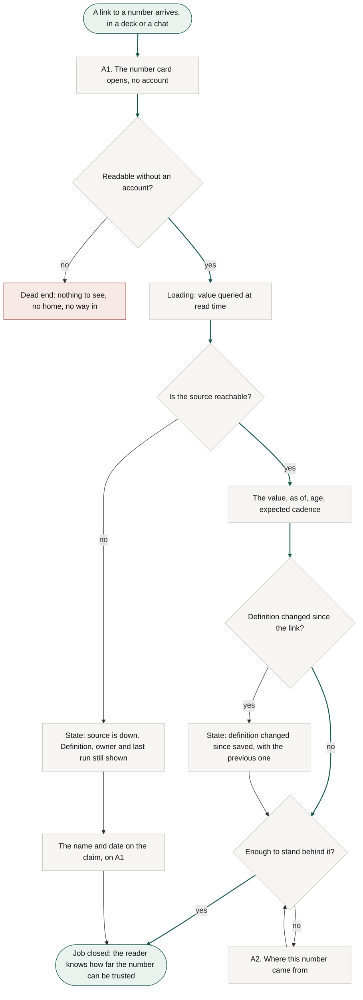
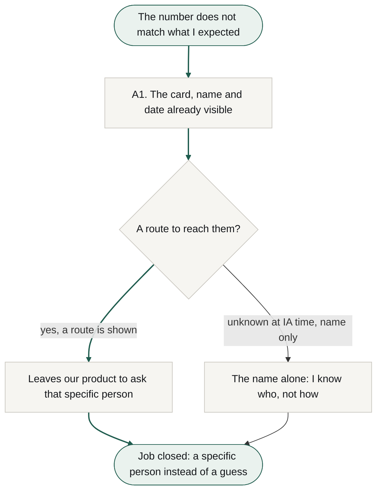
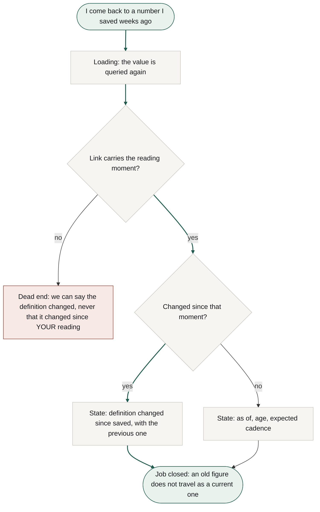
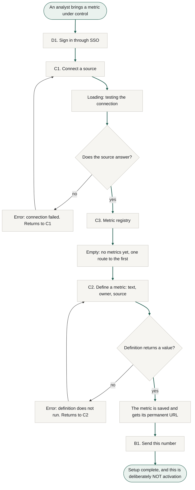

# User flows

Stage 03a, step 4. Routes traced onto the To-Be phases in `research/docs/cjm-to-be.md`, with the As-Is barriers in `cjm-as-is.md` supplying the decision points and the dead ends. Nothing here is invented from the jobs alone.

**Colour is semantic, not decorative.** Green marks the two ends of the happy path, start and job closed, and the path itself is drawn with green arrows. Red marks a **true dead end**, a node with no route to the goal. Grey is everything between, including an error that recovers back into the flow. Tokens are the ones on `research.html`, so the diagrams sit on a light ground rather than punching a dark hole in the page.

Four flows: the main job, two related jobs of the primary persona, and one of the secondary. Every screen node exists in the concept sitemap; nodes that are states or steps rather than screens are named as such underneath each diagram.

---

## Flow 1. Main job: knowing how far the number can be trusted

Traces T1, T2 and T3 in `cjm-to-be.md`. The decision points come from the phase B and phase C barriers.

**Activation node: `A1`.** Activation is the first time a metric card is opened by somebody other than the author of its definition (`aarrr.md`). It is the **first node after the start and sits at zero taps from arrival**, which is what the research asked for: the product does not defer its first value behind anything.

**Decisions.** Whether the card is readable without an account. Whether the source answers. Whether the definition changed after the link was made. Whether what is shown is enough to stand behind.

**States.** Loading while the value is queried, because we store no rows and the number is pulled at read time. "Source is down", which still shows the definition, the owner and the last successful run. "Definition changed after this was saved", carrying the previous definition as a line.

**The one true dead end, and it was predicted at step 3.** A reader who lands on a card they may not see has nowhere to go: no home, no menu, no account, and nothing to sign into. It is red because there is no route to the goal from there, and it is the direct price of flattening the reader's navigation to nothing.

**A consequence of metadata-only, visible here for the first time.** When the source is down there is no value at all, not even a stale one, because we keep no copy. The route does not die there: the definition, the owner and the age of the last successful run are enough to close the main job in its honest form, since the job is to know how far a number can be trusted, not to hold one. **This is the node where the main job and R1 join.**

---

## Flow 2. R1: finding out who is answerable

Traces T4. The `[?]` on the owner's contact route from the entity inventory becomes a decision here rather than staying an open note.

**Decisions.** Only one, and its answer is unknown: whether we may show a route to the owner at all. `personas.md` records that the reader has no account and that what a data lead considers safe to show is an open question.

**Why both branches close the job.** R1 is worded as finding out **who** is answerable, so knowing the name closes it and the asking happens outside our product. The branch without a route is not red, and it is not free either: it returns the reader to the As-Is behaviour of working out how to reach somebody, which is exactly the friction we claim to remove. It is the weakest branch in this IA.

**No screen exists for a person.** The owner is visible on A1 and set on C2, and never gets a page of their own.

---

## Flow 3. R4: an old figure does not travel as a current one

Traces T5. **This flow settles the fork left open in the entity inventory.**

**What this flow decided, and it is a real IA result rather than a drawing.** Entity E6, the reading, was left `[?]` at step 1: either the reading is a stored object or the moment is encoded in the link. The flow shows there is no third option and no neutral one. **If the link does not carry the moment it was read, R4 cannot be served at all**: the state degrades to "the definition changed at some point", which asks the reader to remember when they took the number, which is the very thing they came to us to avoid.

**Resolution: the moment is carried in the link, not stored as an object.** That keeps the permanent URL per metric, adds no record about a reader who has no account, and it is the cheaper of the two. The entity inventory is updated accordingly.

**Decisions.** Whether the link carries the reading moment. Whether the definition changed since it.

**States.** Loading, "definition changed after this was saved" with the previous definition, and the ordinary "as of".

---

## Flow 4. R5: the definition stops living in somebody's head

The secondary persona. Included because R5 and the source connection are preconditions of every flow above, and because the errors here are the only ones in the product that a person can actually fix.

**There is no red node in this flow, and that is not carelessness.** Both errors recover: a failed connection returns to C1 and a definition that does not run returns to C2. The analyst has credentials, an account and a way back, which is exactly what the reader in flow 1 does not have.

**The end of this flow is not activation, and the label says so.** Connecting a source and writing a definition are setup (`aarrr.md`). Activation happens in flow 1, when a second person opens the card. Naming it here stops a later stage from treating a completed analyst setup as the moment of value.

**Decisions.** Whether the source answers. Whether the definition returns a value.

**States.** Loading while the connection is tested, an empty registry on the first run, and two recoverable errors.

---

## What the flows changed in the concept map

- **No new screen appeared.** Every screen node was already in the concept sitemap, which is a small confirmation that the map was derived from jobs rather than assembled loosely.
- **One entity was resolved:** E6, the reading, is not an object. The reading moment travels in the link.
- **One dead end is now explicit** and belongs to the reader: a card they may not see, with nowhere to go. It is carried into the critique at step 6 rather than treated as handled because it is drawn.
